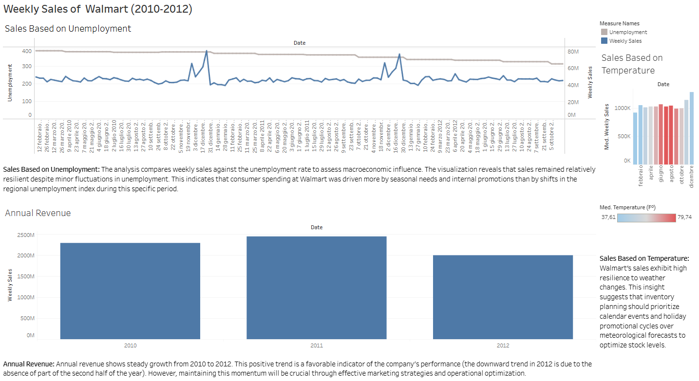
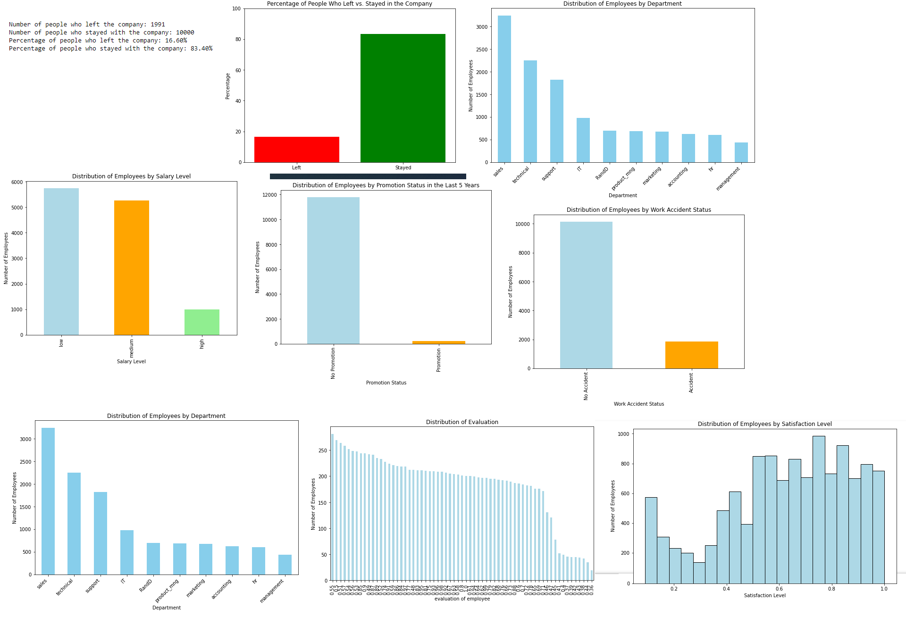
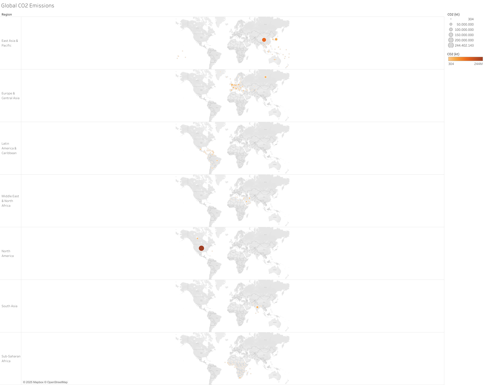
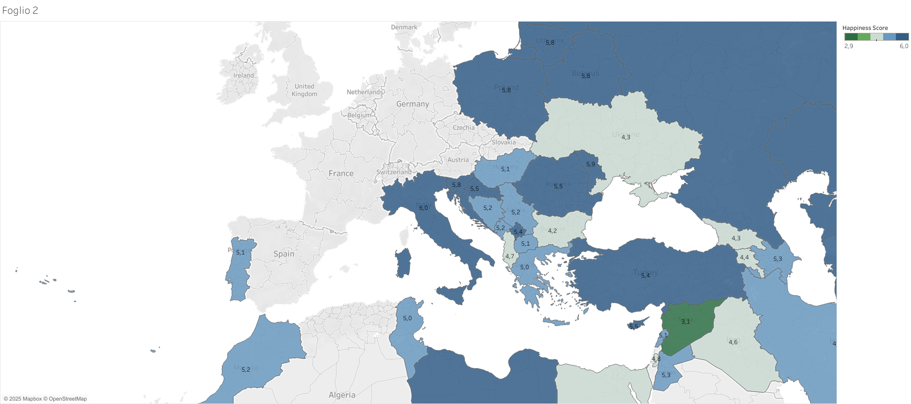

# Progetti Tableau - Introduzione

Questa sezione raccoglie i miei progetti Tableau, sviluppati per acquisire esperienza pratica con le funzionalità base del software. Ogni progetto si concentra sull'esplorazione e la visualizzazione di dataset per identificare trend, pattern e insight. Attraverso questi esercizi ho fatto pratica con le funzionalità chiave di Tableau, come le connessioni ai dati, i campi calcolati, i filtri e i dashboard interattivi.
Questi progetti rappresentano il mio approccio iniziale all'analisi e alla visualizzazione dei dati, e sono al lavoro per sviluppare ulteriormente le mie competenze nel tempo. 
[Qui puoi trovare la mia pagina Tableau].

## Operations & Supply Chain Analysis (Case Study: Walmart)

* **PROBLEMA:** Ottimizzare la gestione delle scorte lavorando su un dataset storico ufficiale di una grande azienda GDO distribuito in formato flat (CSV).

*	**AZIONE:** 

    * Condotta un'analisi esplorativa (EDA) e applicato il metodo dell'Intervallo Interquartile (IQR) utilizzando l’IA per eliminare i rumori di fondo (outlier) nelle vendite e nelle variabili macroeconomiche. l'interquartile ha definito i confini di ciò che è un'oscillazione 'normale' per il mercato di Walmart. Ha eliminato i picchi e i crolli estremi isolando il 50% centrale della distribuzione dei dati. In questo modo, quando ho portato il dataset su Tableau, i grafici mostravano l'andamento reale e ripetibile del business, impedendo a singole giornate anomale o a errori di tracciamento di sballare le medie e portarci a decisioni strategiche sbagliate

    * Sviluppato un modello di serie temporali su Tableau integrando dati meteo e tassi di disoccupazione.

*	**INSIGHT E L'IMPATTO:** È emerso che le vendite sono resilienti alla disoccupazione e ai fattori meteorologici come la temperatura (possiamo notare come a febbraio ci siano vendite molto simili a quelle di giugno, nonostante il clima agli antipodi), ma guidate fortemente dai cicli promozionali interni e dalle festività. 

    Infine possiamo notare una crescita guardando ai ricavi. I ricavi del 2012 sono incompleti degli ultimi mesi dell’anno, ma ho mantenuto volutamente questa visualizzazione per mostrare il Run-Rate, ovvero l'andamento       progressivo del business. Serve a colpo d'occhio per far vedere la solidità della base dei ricavi accumulata nei primi 10 mesi del 2012 rispetto agli interi anni precedenti: dimostra che, pur mancando i mesi               storicamente più forti (novembre e dicembre), il 2012 aveva già quasi raggiunto il fatturato totale del 2010. È la prova visiva di una forte crescita organica dei negozi.

*	**VALORE PER IL CLIENTE:** La raccomandazione strategica è pianificare l'inventory management sulla base del calendario degli eventi promozionali piuttosto che sulle previsioni meteo a breve termine, riducendo i costi di stoccaggio.

## Employee Retention Analysis

Questa è una dashboard che ho costruito con Python con il supporto di una guida del corso di analisi dati che ho preso qualche anno fa, con un dataset fornito dallo stesso.

* **PROBLEMA:** Comprendere i driver di una azienda della GDO che spingono il personale a licenziarsi (Turnover al 16.66%) per ridurre i costi di recruitment e la perdita di know-how.

*	**AZIONE:** Creato un ecosistema di grafici interattivi in Tableau per incrociare variabili quantitative (stipendio, valutazioni delle performance) e qualitative (reparto di appartenenza, storico delle promozioni).

*	**INSIGHT E L'IMPATTO:** Il reparto Sales (Vendite) è il cluster più numeroso e che è di conseguenza più a rischio. L'analisi visiva evidenzia che il fattore scatenante non è solo lo stipendio medio-basso, ma la stagnazione delle carriere (promozioni quasi assenti negli ultimi 5 anni) e i numerosi infortuni sul lavoro (circa il 20%). 

*	**VALORE PER IL CLIENTE:** La raccomandazione strategica è un'azione mirata su due fronti:

    *	Per il Sales: Ristrutturare i piani HR introducendo bonus legati alle performance e percorsi di carriera chiari per trattenere i top performer.

    *	Per le Operations: Investire immediatamente in sicurezza, revisione dei turni e automazione nei magazzini per abbattere quel 20% di infortuni, riducendo i costi legati alle assenze e ripristinando l'efficienza operativa.

## Dashboard Emissioni Globali di CO2 (Tableau)

* **PROGETTO:** Una dashboard interattiva su Tableau per mappare e confrontare l'impatto ambientale globale, analizzando sia le emissioni totali di CO2 (in kilotoni) sia quelle pro-capite per nazione e macro-regione.

* **SCELTE VISIVE:** 

    * Mappa Geospaziale: Sfrutta le dimensioni geografiche di Tableau. La dimensione dei punti indica l'impatto assoluto dei singoli Paesi, mentre un gradiente di colore evidenzia la scala delle emissioni.

    * Analisi Pro-Capite: Grafici integrati sulla mappa mondiale per confrontare l'intensità di carbonio delle diverse macro-aree (es. Europa, Asia-Pacifico).

* **FUNZIONALITA' E STRUMENTI:** Connessione diretta e aggregazione delle metriche sul dataset, ottimizzazione di etichette e colori per la massima leggibilità, e tooltips interattivi al passaggio del mouse per il dettaglio sul singolo Paese.

* **INSIGHT STRATEGICO:** Identificazione visiva immediata delle aree industriali più inquinanti e dei cluster regionali con la più alta intensità di CO2 per abitante. È uno strumento di governance essenziale per comprendere i pattern globali e valutare l'efficacia delle politiche climatiche territoriali.

## Dashboard World Happiness Score (Tableau)

* **PROGETTO:** Una visualizzazione geografica interattiva basata su un dataset Kaggle, sviluppata per mappare, analizzare e confrontare i livelli di felicità (Happiness Score) tra le diverse nazioni del mondo.

* **SCELTE VISIVE:** Una mappa mondiale geospaziale che utilizza una scala cromatica intuitiva per evidenziare il benessere globale: blu per i punteggi di felicità più alti e verde per quelli più bassi. L'impatto visivo è potenziato dall'integrazione di etichette dati dirette e una legenda a barre per una lettura immediata delle differenze tra i Paesi.

* **FUNZIONALITA' E STRUMENTI:** Pulizia e normalizzazione preventiva dei dati (gestione dei missing values e allineamento dei nomi geografici). In Tableau sono stati configurati livelli cartografici avanzati tramite Mapbox e OSM, ottimizzando l'esperienza utente con funzioni interattive di zoom, navigazione e tooltip informativi al passaggio del mouse (hover).

* **INSIGHT STRATEGICO:** Identificazione immediata dei cluster geopolitici del benessere, mostrando visivamente il divario socio-economico tra le macro-regioni del mondo. È uno strumento di analisi territoriale immediato, fondamentale per correlare la percezione della qualità della vita con i macro-indicatori di sviluppo dei singoli Stati.

